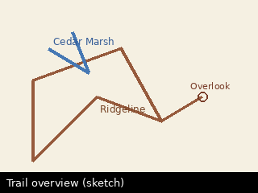

# Trail map overview

A rough sketch of how the trails connect. The
[Quarry Overlook](../trails/quarry-overlook.md) spur branches off the
[Ridgeline Loop](../trails/ridgeline-loop.md); the
[Cedar Marsh Boardwalk](../trails/cedar-marsh.md) is a separate trailhead
entirely.

> There is also a stray photo in `assets/loose-photo.png` with no note pointing
> at it — open it straight from the file tree to test the image viewer on its
> own.
