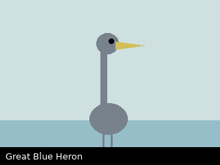

# Markdown kitchen sink

A single note that exercises as many markdown features as possible, so the
reader and the editor can be eyeballed against all of them at once. It also
deliberately breaks the house style (over-long lines, bare URLs) — which is why the fixture is excluded from markdownlint.

## Headings

### Level 3

#### Level 4

##### Level 5

## Emphasis

*italic*, **bold**, ***bold italic***, `inline code`, and ~~strikethrough~~.

## A very long line that should test soft wrapping

This paragraph is intentionally written as one very long unbroken line so that the reader has to soft-wrap it and we can see whether wrapping, hyphenation, and horizontal overflow all behave the way they should on both wide desktop windows and narrow e-ink panels.

## Lists

1. First
2. Second
   1. Nested ordered
   2. Sibling
      - Deep unordered
      - Another
3. Third

- [ ] Unchecked task
- [x] Checked task

## Blockquote

> A quote,
> spanning two lines,
>
> > and a nested quote inside it.

## Table

| Species | Where | Count |
| --- | --- | ---: |
| Eastern Bluebird | Ridgeline meadow | 2 |
| Great Blue Heron | Cedar Marsh channel | 1 |
| Barred Owl | Cedar turnaround | 1 (heard) |

## Code block

```dart
void main() {
  for (final walk in ['May 2', 'May 9', 'May 17']) {
    print('Walked: $walk');
  }
}
```

## Horizontal rule

---

## Links

- Internal: [home](../index.md)
- Bare URL: https://flutter.dev
- Autolink: <https://dart.dev>

## Image


