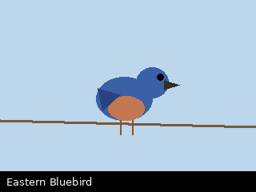

# Eastern Bluebird

*Sialia sialis*

Small thrush; the male an unmistakable deep blue above with a rusty breast.
Favors open meadow with perches — fencelines, isolated snags.

## Where seen

- [Ridgeline Loop](../../trails/ridgeline-loop.md), first meadow fenceline.

## On these walks

- [2026-05-02](../../daily/2026-05-02.md) — a pair, first of the year.
- [2026-05-17](../../daily/2026-05-17.md) — one, sheltering from rain.
