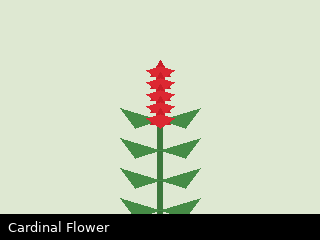

# Cardinal Flower

*Lobelia cardinalis*

Wetland perennial with a spike of intense scarlet flowers in mid-to-late summer.
Hummingbird-pollinated. The colour is hard to overstate.

## Where seen

- [Cedar Marsh Boardwalk](../../trails/cedar-marsh.md), right off the rail.

## On these walks

- [2026-06-01](../../daily/2026-06-01.md) — budding, not yet open. Check back in
  July.
